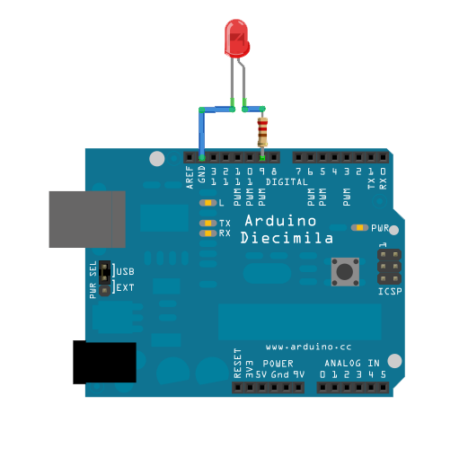

Comenzamos montando el led. Pondremos una resistencia de 100-300ohmios en serie con el led, ya que el led funciona a unos 3V

Si usamos una placa de prototipo, el montaje sería algo así

El esquema eléctrico de este sencillo circuito es

El código para hacer un parpadeo sería así:
    #define led 13
    void setup()                // Función de configuración
    {
      pinMode(led,OUTPUT);       // Vamos a usar una salida
    }

    void loop()  // Función de bucle. Se repite por siempre
    {
      digitalWrite(led,HIGH);    // Activamos la salida 13
      delay(1000);              // Esperamos
      digitalWrite(led,LOW);     // Desativamos la salida 13
      delay(1000);              // Esperamos
    }                           // Cuando termina se vuelve a ejecutar

## Relés

Un montaje muy similar nos permite controlar un rele que actua como un interrruptor electrónico. Dependiendo de la capacidad del relé se podrán controlar distintos tipos de corrientes.

Pero ¡¡cuidado!!

## Control analógico de un led

Si conectamos el led a un pin PWM (analógico) podemos dar distintos niveles de brillo (entreo 0 y 255)

Con este sencillo código

    void setup()                        // configuracion
    {
      pinMode(9,OUTPUT);                // Usaremos la patilla 5 como salida
      Serial.begin(9600);               // Configuramos la conexión con el PC
    }

    void loop()
    {
      int valorSalida=0;                // la variable valorSalida empieza en 0
      while (valorSalida < 256) {       // Haremos el bucle hasta que llegemos a 256
        analogWrite(9,valorSalida);     // pasamos el valor a la patilla 5
        Serial.println(valorSalida);    // Enviamos al pc la variable
        delay(100);                     // Esperamos 0,1 segundos
       }

    }
