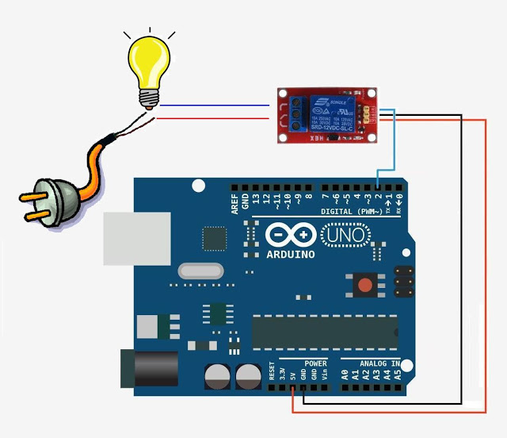

Comenzamos montando el led. Pondremos una resistencia de 100-300ohmios en serie con el led, ya que el led funciona a unos 3V

Si usamos una placa de prototipo, el montaje sería algo así

El esquema eléctrico de este sencillo circuito es

## Relés

Un montaje muy similar nos permite controlar un rele que actua como un interrruptor electrónico

Pero ¡¡cuidado!!

