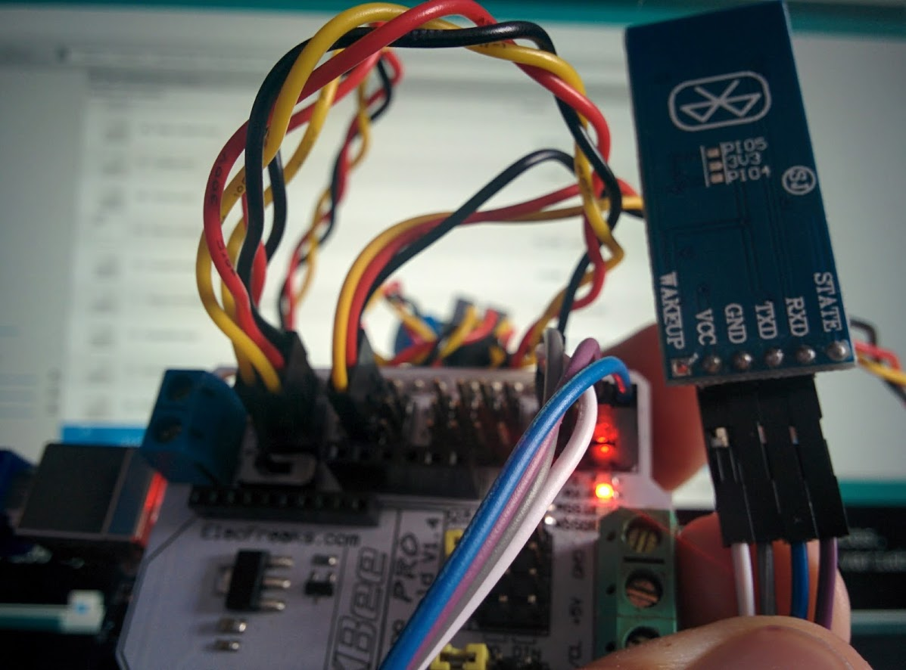

# Bluetooth

## Conectar la placa

Basta con conectar Vcc a 5v, GND a GND y Rx a Tx y Tx a Rx

## Programación

Podemos usar las comunicaciones serie normales

Cuando enviemos un '1' se encederá el relé que tenemos conectado en  el pin 9

    int rele_motor=9;
    void setup() {
      Serial.begin(9600);
      pinMode(rele_motor,OUTPUT);
    }

    void loop() {
      while(Serial.available()>0)
      {
        int iChar=Serial.read();
        Serial.println((char)iChar);
        if(iChar=='1')
          digitalWrite(rele_motor,HIGH);
        else
         digitalWrite(rele_motor,LOW);
      }
    }
## Controlar desde el móvil

Debemos emparejar el Bluetooth con nuestro móvil y utilizando alguna aplicación (Blueterm) enviar los datos

[Video]
