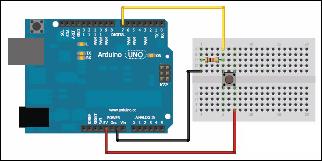
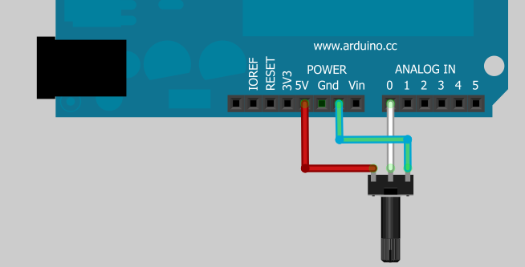
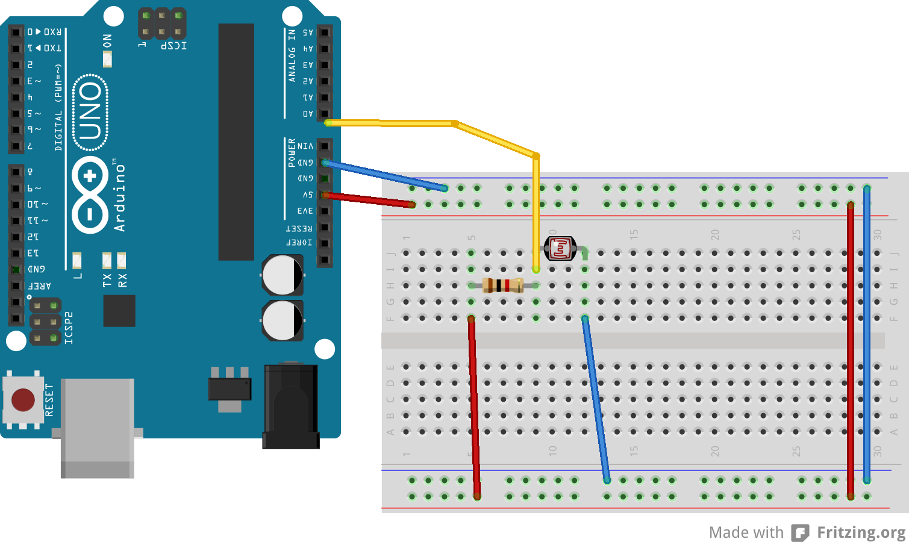

# Interacción digital

## Pulsadores

Usaremos un pulsador que activará cuando esté pulsado un led en parpadeo.

1. Usaremos el montaje de [led](./Led.md)
1. Montamos el pulsador con la resistencia pull-down

2. Con una sentencia condicional haremos que se encienda el parpadeo

    if(digitalRead(pinBoton)==HIGH) { .....}

## Sensores táctiles (inductivos)

# Interacción analógica

Desde las entradas analógicas (A0 a A5) podremos leer señales analógicas entre 0 y 5V. Por sencillez, estos valores se mapean en el rango entre 0 y 1023

Leeremos los valores con la función

  int valor = analogRead(Ax);

## Potenciómetro

El montaje es sencillo

El código:

    int led10 = 10;
    int potenciometro = A0;

    void setup() {
        pinMode(led10, OUTPUT);
        Serial.begin(9600);
    }

    void loop() {
        digitalWrite(led10, HIGH);
        Serial.println("Encendido");
        delay(analogRead(potenciometro));
        digitalWrite(led10, LOW);
        Serial.println("Apagado");
        delay(analogRead(potenciometro));
    }

## Medida de LUZ

## Escalar los valores

Hemos visto que la lectura de las entradas analógicas siempre da valores entre 0 y 1023. Podemos convertir estos valores a otro rango usando la función map

    // x varían entre -200 y 200
    // queremos escalarlo al rango 0-255 de una salida PWM

    int nuevoValor=map(x,-200,200,0,255);

## Acelerómetro

Un acelerómetro es capaz de leer datos de posición (hay diferentes formas de hacerlo)

Cada modelo se mide de forma distinta, veamos el [HMC5883L](http://www.elecfreaks.com/wiki/index.php?title=Octopus_3-Axis_Digital_Compass_Sensor)
Leeremos los valores y lo convertimos a grados de colores RGB

    #include <Wire.h> //I2C Arduino Library

    #define address 0x1E //0011110b, I2C 7bit address of HMC5883

    void setup(){
      //Initialize Serial and I2C communications
      Serial.begin(9600);
      Wire.begin();

      //Put the HMC5883 IC into the correct operating mode
      Wire.beginTransmission(address); //open communication with HMC5883
      Wire.write(0x02); //select mode register
      Wire.write(0x00); //continuous measurement mode
      Wire.endTransmission();
    }

    void loop(){

      int x,y,z; //triple axis data

      //Enviamos el comando de pedir datos
      Wire.beginTransmission(address);
      Wire.write(0x03); //select register 3, X MSB register
      Wire.endTransmission();

     // Leemos los registros, (2 bytes cada uno)
      Wire.requestFrom(address, 6);
      if(6<=Wire.available()){
        x = Wire.read()<<8; //X msb
        x |= Wire.read(); //X lsb
        z = Wire.read()<<8; //Z msb
        z |= Wire.read(); //Z lsb
        y = Wire.read()<<8; //Y msb
        y |= Wire.read(); //Y lsb
      }

      // Imprimimos los datos
      Serial.print("x: ");
      Serial.print(x);
      Serial.print("  y: ");
      Serial.print(y);
      Serial.print("  z: ");
      Serial.println(z);

      // Convertimos los valors al rango de PWM
      int rojo=map(x,-500,500,0,255);
      int azul=map(y,-500,500,0,255);
      int verde=map(z,-500,500,0,255);

      analogWrite(10,rojo);
      analogWrite(11,azul);
      analogWrite(12,verde);

      delay(250);
    }

## Ejercicios

### Voltímetro

Vamos a añadir al ejemplo anterior la medida de voltaje.

Calculamos el voltaje que tendrá el pin A0 con la fórmula

    v=lectura*5.0/1023

(hay que recordar la importancia de hacer el cálculo con número decimales)

Enviamos datos al PC

### Control de un dimmer con  un potenciómetro

### Control del color de leds RGBs con 3 potenciometros

