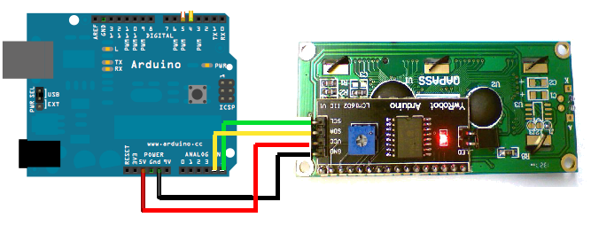

Existen varias librerías:

* [Librería LCD MF](https://bitbucket.org/fmalpartida/new-liquidcrystal/wiki/Home)
* [Ejemplos lcd](http://arduino-info.wikispaces.com/LCD-Blue-I2C#v3)
* [Ejemplo bq](http://diwo.bq.com/programando-lcd/)

## Montaje

## Código

    #include <Wire.h>
    #include <LiquidCrystal.h>

    LiquidCrystal lcd(0x27);  // El fabricante nos debe decir la dirección

    void setup()
    {
      lcd.begin(16, 2);  //Geometria del lcd
      lcd.clear();

    }

    void loop()
    {
      lcd.setCursor(0,0);       // Nos movemos a la posición
      lcd.print("Hola Mundo");  // Mostramos un texto

    }
